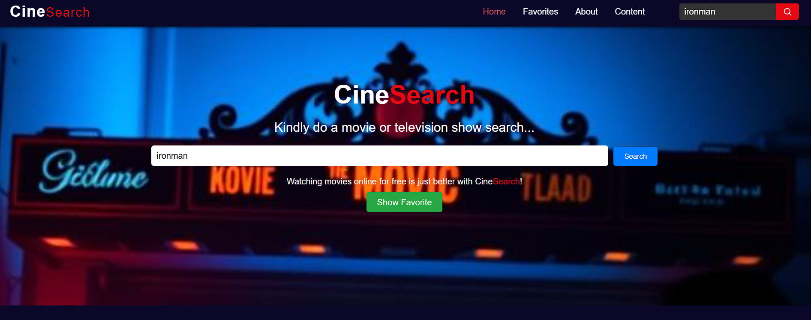
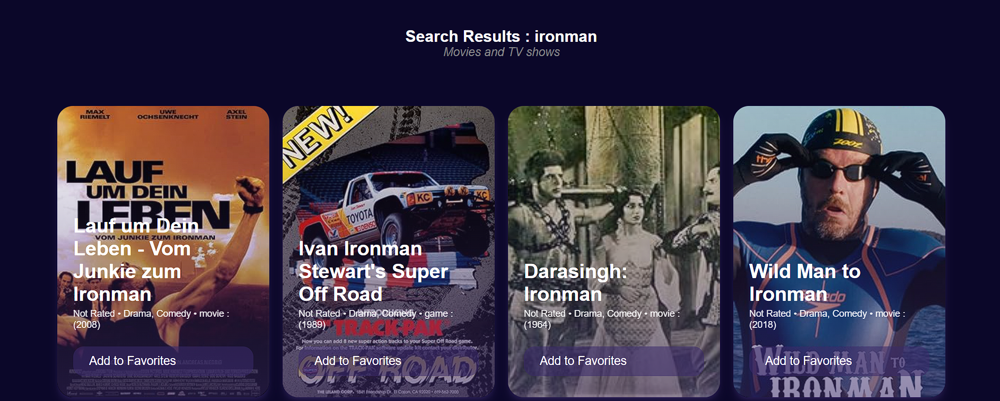
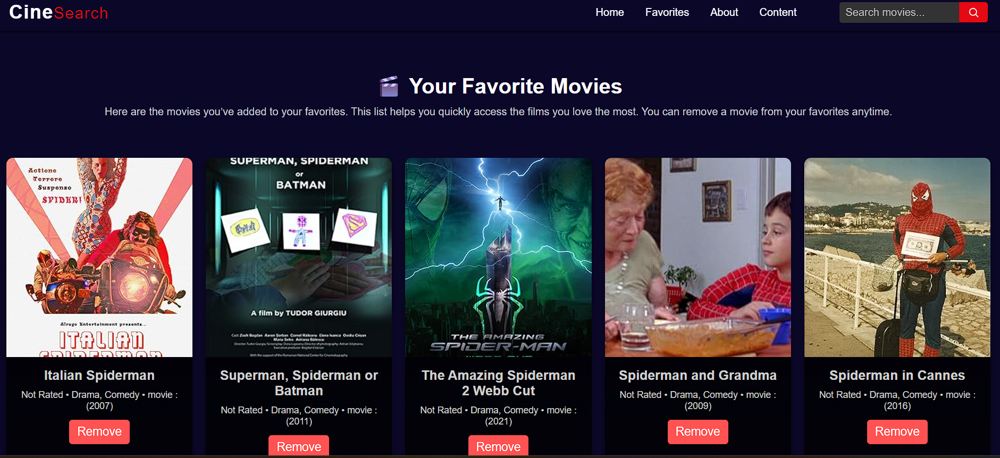
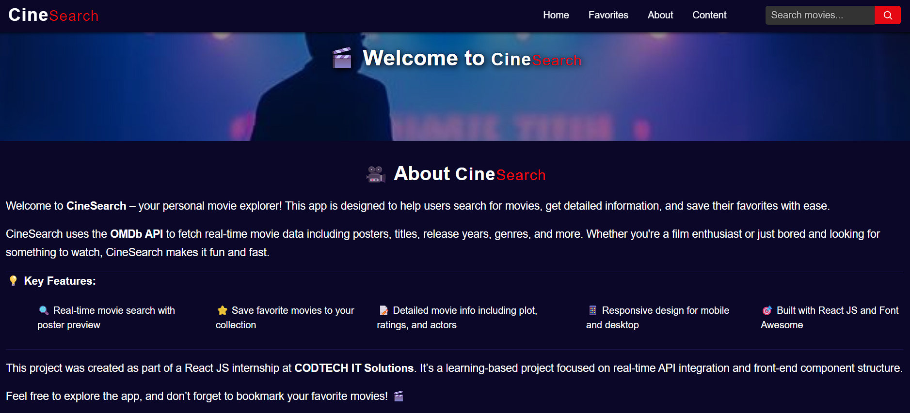
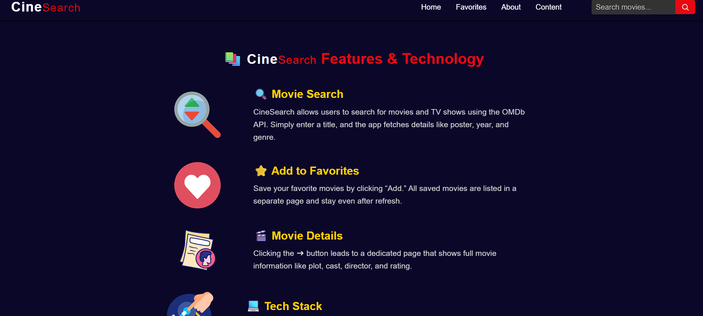

# 🎬 MOVIE SEARCH APP

**COMPANY:** CODTECH IT SOLUTIONS  

**NAME:** Mo Aslam Khan  

**INTERN ID:** CT08DN1583  

**DOMAIN:** React.js Web Development  

**DURATION:** 8 WEEKS  

**MENTOR:** NEELA SANTOSH

---

## 📄 TASK DESCRIPTION

CineSearch is a responsive, React.js-based movie search web application developed as part of my internship with CODTECH IT Solutions. The core objective of this project was to design a user-friendly interface where users can search movies, explore their details, and build a personal collection of favorites. The project showcases skills in API integration, React routing, component structuring, and modern frontend design.

The application uses the OMDb API (Open Movie Database API) to fetch real-time movie data such as titles, posters, release years, genres, and ratings. Users can search by movie or TV show title and view the results instantly. Each result comes with an option to add the movie to a favorites list. Favorites are stored temporarily and can be removed at any time.

A key part of this project was ensuring that the **API key is not exposed** in the live project or on GitHub. Instead of uploading my key publicly, I used a placeholder in the URL like:

https://www.omdbapi.com/?s=MovieName&apikey=ENTER_YOUR_API_KEY_HERE

This ensures that anyone cloning or using the project will need to replace the placeholder with their own OMDB API key. Developers can use a `.env` file to securely store and access their keys using `process.env`.

---

## 🔧 Technologies Used

- **React.js** – Frontend framework for component-based architecture  
- **JavaScript (ES6+)** – For fetching API data and managing state
- **React Router** – For client-side routing and multi-page navigation 
- **HTML5 & CSS3** – For styling, layout, and responsive design  
- **OMDB API** – For retrieving movie data  
- **Git & GitHub** – For version control and project hosting  

---

## ✅ Functionality & Features

**Live Movie Search:**
- Users can type the name of any movie or TV show into the search box. The app sends an API request to fetch matching titles and displays the results with posters and descriptions.
  
**Favorites Management:**
- Users can click the "Add to Favorites" button on any movie card to save it. Saved items are shown in the “Favorites” section. They can remove movies anytime using the “Remove” button.
  
**Movie Details:**
- Each card includes detailed information like title, genre, release year, type, and poster image to give users a snapshot of the movie.
  
**Multi-Page Navigation:**
- The app includes multiple pages such as Home, About, Favorites, and Content. These pages are navigable using React Router for a seamless SPA (Single Page Application) experience.
  
**Modern UI & UX:**
- The UI is built with a dark theme, colorful icons, and smooth transitions. The design is responsive for both desktop and mobile devices, offering a polished look and feel.
  
**Safe API Handling:**
- The API key used for OMDb is not exposed in the GitHub repository. Instead, a placeholder (API_KEY = "EnterYourAPIKeyHere") is used to prevent misuse. Users cloning the project must use their own OMDb key.

The user interface is designed to be minimal and modern, with cards showing each movie result. The layout adapts well to different screen sizes, ensuring usability on both mobile and desktop devices. The app includes animation or hover effects for a smoother UI experience.

---

## 🔒 API Key Handling

To keep the OMDb API key safe and prevent it from being exposed publicly, I did not upload the actual API key to the GitHub repository. Instead, I used a placeholder value in the fetch URL like this:

1. **Do not commit the API key.**
2. Replace it with a placeholder:

https://www.omdbapi.com/?s=${searchTerm}&apikey=YOUR_API_KEY_HERE

If anyone wants to use this project locally, they must create a free API key by registering on https://www.omdbapi.com/, and then replace YOUR_API_KEY_HERE with their own valid API key either:

Directly in the code for testing,
or

Better, by storing it in an environment file (like .env) and accessing it via process.env.REACT_APP_OMDB_API_KEY for improved security in production setups.

---

## 📸 Preview Output
**Home Page:** - Welcomes users and prompts them to search

**Search Results:** - Displays real-time results from the OMDb API

**Favorites Page:** - Shows all added favorite movies with remove option

**About & Content Pages:** - Explains project details and technologies used

